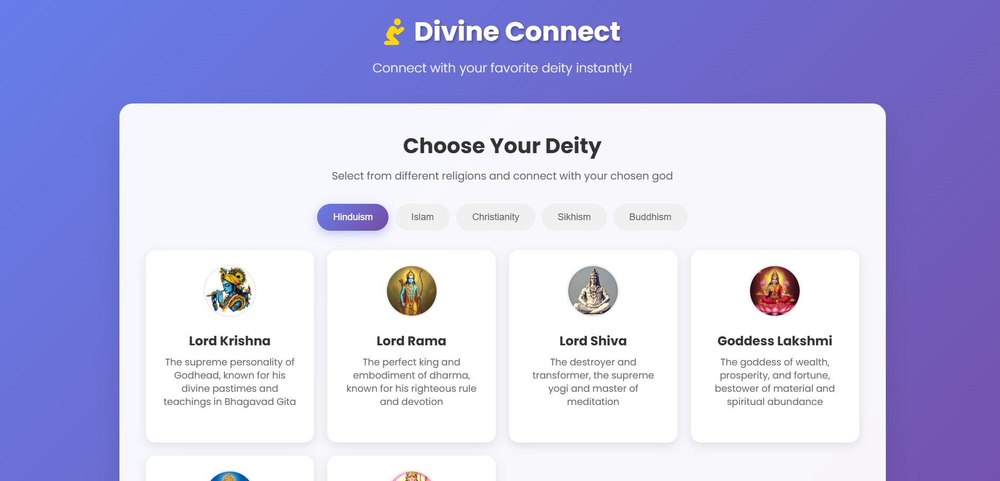
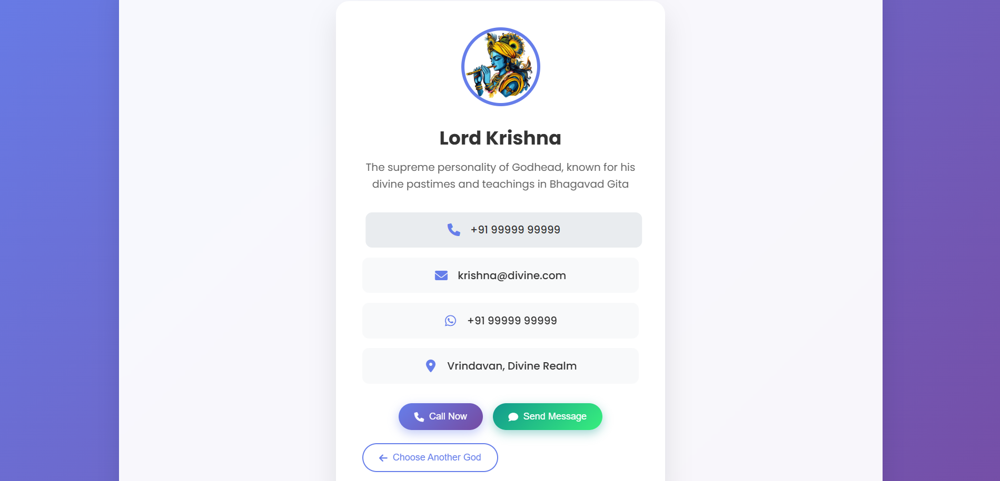
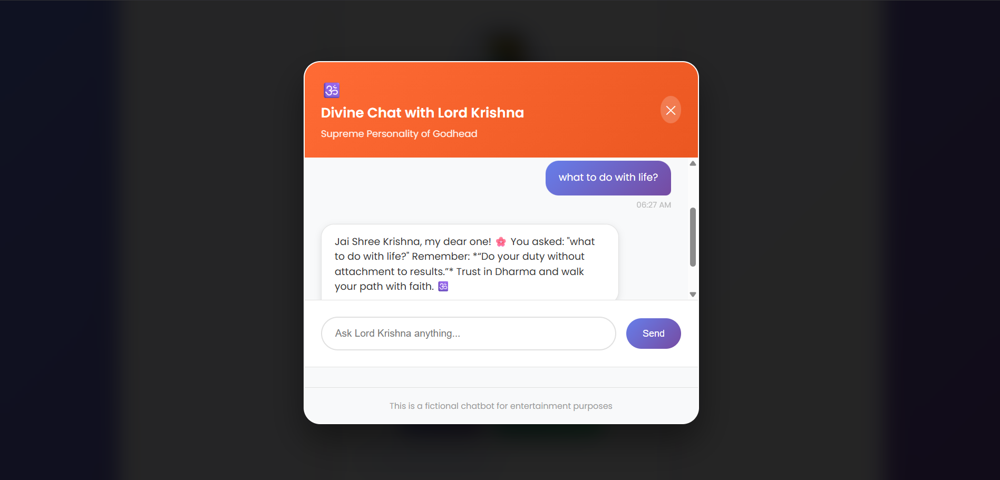

# Divine Connect 🎯

## Basic Details
### Team Name: Snehamol K M's Team

### Team Members
- Team Lead: Snehamol K M - Adi Shankara Institute of Engineering and Technology

### Project Description
Divine Connect is a fun website where users can select their favorite deity, get their (totally fictional) contact number, and even chat with them using AI-generated divine responses. 
A light-hearted twist on religion and technology

### The Problem (that doesn't exist)
People worship for years hoping for a sign from God. 
But let’s be real — where’s the contact info? Where’s the reply?

### The Solution (that nobody asked for)
I built a website where: 
You can choose a god (e.g., Krishna, Shiva, Ganesha , Jesus , Allah). 
You'll get their “celestial” phone number. 
You can call them or start a chat with them. 
The gods reply instantly — because they run on JavaScript. 

## Technical Details
### Technologies/Components Used
For Software: 

Frontend: HTML, CSS, JavaScript 
Backend:  
Libraries/Tools:  
dotenv  
fetch API  
Open AI API  
JSON-based "divine logic"  

### Implementation
For Software:  
# Installation
cd krishna-backend  
npm install  

# Run
node server.js  
go to index.html  

### Project Documentation
For Software:  

# Screenshots 

  
*This shows the landing page of Divine Connect*

  
*This is the chat interface with Lord Krishna*

  
*This section displays phone numbers of various Gods you can "contact"*

# Diagrams
![Workflow]

### Project Demo
# Video
https://drive.google.com/drive/folders/1UNecACPckHo35CKm-1BQEPnYJGpYohIj?usp=sharing

